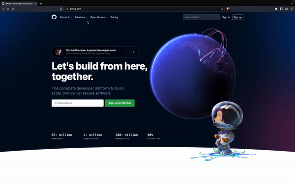
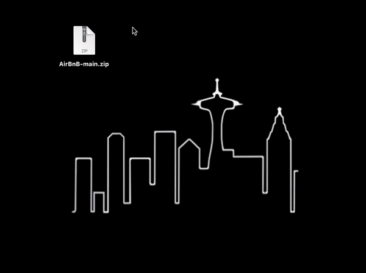

<!-- 
An AirBnB Clone
 -->

_
 Market, and mark it off your list 
_

---
 

## ✅ Directory

[Description](https://github.com/kevinlongboy/AirBnB/blob/main/README.md#-welcome-to-seattle)  
[Features](https://github.com/kevinlongboy/AirBnB/blob/main/README.md#-api-overview)  
[Download](https://github.com/kevinlongboy/AirBnB/blob/main/README.md#-get-started)  
[Upcoming](https://github.com/kevinlongboy/AirBnB/blob/main/README.md#-future-implementations)  
[Tech Stack](https://github.com/kevinlongboy/AirBnB/blob/main/README.md#-languages-and-libraries-used)  
[Demo](https://github.com/kevinlongboy/AirBnB/blob/main/README.md#-visit-the-site)  
[Connect](https://github.com/kevinlongboy/AirBnB/blob/main/README.md#-im-listening)  

 
 

---

##  ✅ Let's Go Shopping
  
Welcome to Market, your one-stop shop for everything you need.

Inspired by <a href="https://www.target.com/" alt="Target website">AirBnB</a>, Market gives shoppers the ability to browse products, view past orders, read reviews, and checkout.

 
 

---

##  ✅ Guest Services

### Cart

_The main feature of Market_

As a Host, users are able to list their home on the site and highlight its best qualities in the listing. Hosts should give a brief description of their home, henceforth known as a "Spot", then choose a befitting rate for a nightly stay.

As a Guest, users are able to peruse through CraneBnB to find the perfect place for their stay in Seattle.

 

### Reviews

_Hear the people's voice_

CraneBnB gives its members the ability to voice their opinions and share their experiences from previous stays.

Users can also delete any reviews they've previously posted, if they so choose.
 
 

---

##  ✅ Self-Checkout

Ready to install the Market API? Follow the instructions below:

### 1. Navigate to GitHub:
* Click <a href="https://github.com/kevinlongboy/Market" alt="Market GitHub repository link">here</a> to be redirected to the Market page

### 2. Download the API: 
* Click the "Code" button
* Select "Download ZIP" from the dropdown menu
* Save the file in your desired location

### 3. Open the repository:
* Navigate to the location where you previously saved your zipped file
* Unzip the file by double-clicking on the icon, or by right-clicking on the icon and selecting "Open"
* This unzipped folder is the repository which contains both the backend and frontend components of the API

### 4. Initialize the backend: 
* Open a new terminal
* Navigate to the _backend_ folder
* Download dependencies by running the command: "npm install"
* Initialize your database by running "npx dotenv sequelize db:migrate"
* Populate your database by running "npx dotenv sequelize db:seed:all"
* Start the backend server by running the command: "npm start"

### 5. Initialize the frontend: 
* Open a new terminal
* Navigate to the _frontend_ folder
* Download dependencies by running the command: "npm install"

### 6. Launch the app:
* From the _frontend_ folder, run the command: "npm start"
* Allow React to open the app in your browser
* Welcome to CraneBnB

 
 

---

##  ✅ Preview

### Favorites

Bookings will supplement the Spots feature with functionality. Guests will be able to make, modify, and delete a reservation for a Spot, while Hosts will be able to view and manage any reservations for their own listings.
 
 

### Registries

Images feature will bring life to both Spots and Reviews. Hosts will have the ability to add, modify, and delete images for their Spot listings, and Guests will be able to do the same for any reviews they've written.
 
 

---

##  ✅ Discount Codes

### Framework:

 

### Frontend:

 

### Backend:

 
  
---

##  ✅ Free Sample

Ready for some retail therapy? Click the icon below to be redirected to Heroku, the current hosting site for the fullstack API:

 
 

---  
##  ✅ Contact Us

 
 
